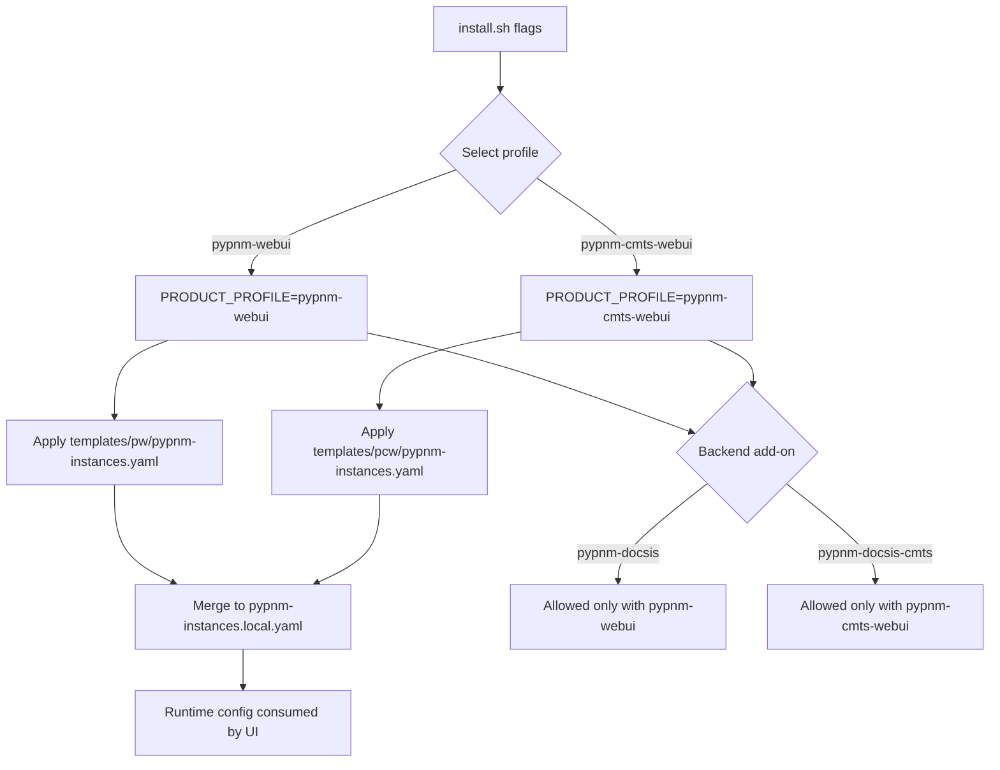

# Architecture

## Purpose

`PyPNM-CMTS-WebUI` is a frontend application for CMTS REST APIs.

- UI handles request composition and visualization.
- CMTS backend remains source of truth for data and analysis.

## Current MVP UI surfaces

- `Serving Group` (RxMER first operation)
- `SingleCapture`
- `Spectrum Analyzer`
- `Health`
- `Settings`
- `About`

## Source layout

- `src/pcw`: CMTS-specific UI/workflow code
- `src/pw`: PW-derived shared UI/workflow code
- `src/components/common`: reusable UI pieces
- `src/services`: shared infrastructure services (`http`, `health`, `files`, etc.)
- `src/types`: request/response contracts
- `src/lib`: pure shared helpers

### Source tree

```text
src/
├── pcw/
│   ├── pages/                      # CMTS-specific route pages (non-feature grouped)
│   │   ├── CmtsSg*WorkflowPage.tsx
│   │   └── Health/Settings/About/File* pages
│   ├── features/
│   │   ├── serving-group/          # SG request forms, status, and result models
│   │   ├── spectrum-analyzer/      # CMTS SA result components
│   │   └── single-capture/         # CMTS single-capture dashboard + entry workflow
│   └── services/
│       └── servingGroup*Service.ts # CMTS /cmts/... API clients
├── pw/
│   ├── pages/
│   │   ├── EndpointExplorerPage.tsx
│   │   ├── AdvancedPage.tsx
│   │   └── AnalysisViewerPage.tsx
│   ├── features/
│   │   ├── operations/             # Shared operation request forms + visuals
│   │   ├── advanced/               # Shared advanced analysis workflows
│   │   ├── analysis/               # Shared chart/analysis components
│   │   └── single-capture/         # Selected modem context + request context
│   └── services/
│       ├── advanced/
│       ├── captureConnectivityService.ts
│       └── singleCaptureService.ts
├── components/common/              # Reusable UI primitives
├── services/                       # Shared infra services (http, health, files)
├── types/                          # Typed request/response contracts
└── lib/                            # Shared pure utilities
```

### Responsibility breakdown

- `src/pcw/pages`: own CMTS route pages that are not feature-grouped workflows.
- `src/pcw/features`: own CMTS operation-specific UI and result shaping.
- `src/pcw/services`: own CMTS-specific endpoint calls under `/cmts/...`.
- `src/pw/pages`: own shared PW-style operation browsing and rendering shells.
- `src/pw/features`: own shared forms/charts/view logic reused across workflows.
- `src/pw/services`: own shared capture/connectivity calls used by PW-style flows.
- `src/services`: own app-wide infrastructure concerns independent of PW/PCW split.
- `src/components/common`: own reusable visual primitives and interaction widgets.
- `src/lib` and `src/types`: own shared utilities and contracts used across both trees.

## Serving Group RxMER architecture

- route page: `src/pcw/pages/CmtsSgRxMerWorkflowPage.tsx`
- single-capture dashboard route page:
  `src/pcw/features/single-capture/pages/CmtsSingleCaptureDashboardPage.tsx`
- reusable request form: `src/pcw/features/serving-group/components/ServingGroupCaptureRequestForm.tsx`
- API transport: `requestWithBaseUrl` in `src/services/http.ts`
- runtime instance selection from YAML via app provider

## PW and PCW contract shim

PCW reuses PW request and visualization flows. A compatibility shim in
`src/lib/pwCompat.ts` defines the contract for endpoint translation.

- PW API paths are mapped through one adapter (`toPwApiPath`)
- PCW-only APIs (`/cmts/...`) pass through unchanged
- Shared flows call the shim, not hardcoded prefixes

```mermaid
flowchart LR
  UI[PW-style UI Flows<br/>EndpointExplorer, Single Capture, Files]
  NAV[Operation Registry<br/>operationsNavigation]
  SERVICES[Service Layer<br/>captureConnectivityService<br/>pnmFilesService<br/>singleCaptureService]
  SHIM[pwCompat contract<br/>toPwApiPath(path)]
  PWAPI[/PW API via embedded prefix<br/>/cm/docs/...<br/>/cm/system/.../]
  PCWAPI[/PCW-native API<br/>/cmts/.../]
  BACKEND[PyPNM-CMTS backend]

  UI --> NAV
  UI --> SERVICES
  NAV --> SHIM
  SERVICES --> SHIM
  SHIM --> PWAPI
  SHIM --> PCWAPI
  PWAPI --> BACKEND
  PCWAPI --> BACKEND
```

## Unified install profile architecture (Phase 1)

Installer now enforces an explicit product profile and profile-matched backend
add-on packages.

- profiles:
  - `--with-pypnm-webui`
  - `--with-pypnm-cmts-webui`
- backend add-ons:
  - `--with-pypnm-docsis` (PW profile only)
  - `--with-pypnm-docsis-cmts` (PCW profile only)

Installer guardrails reject mixed profile/package combinations.

The selected profile is persisted to `.env` as `PRODUCT_PROFILE`.

Runtime template selection is profile-aware:

- `public/config/templates/pw/pypnm-instances.yaml`
- `public/config/templates/pcw/pypnm-instances.yaml`
- copied to `public/config/pypnm-instances.yaml` before runtime local merge

Config editing is also profile-aware:

- `config-menu` resolves profile from `.env`
- menu branding switches between PyPNM and PyPNM-CMTS naming
- schema preview and request-default validation are profile-scoped



## Constraints

- no backend logic in UI
- strict typing for payload contracts
- reusable shared components for repeated request patterns
- theme parity across dark and light modes
