# Form Gallery

Auto-captured form screenshots for navigation and quick reference.

Base URL captured: `http://127.0.0.1:4175`

To regenerate:

`npm run docs:capture-form-gallery`

## Serving Group

### Serving Group · RxMER

Route: `/serving-group/rxmer`

[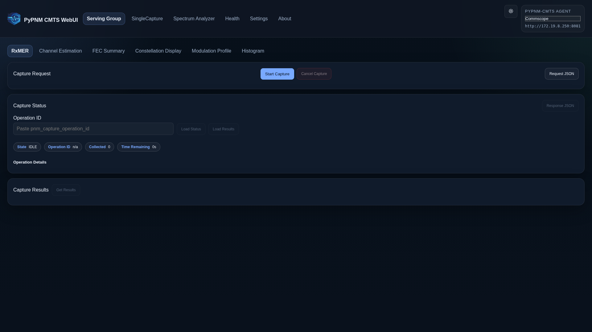](../../images/forms/serving-group-rxmer-form.png)

### Serving Group · Channel Est Coeff

Route: `/serving-group/channel-est-coeff`

[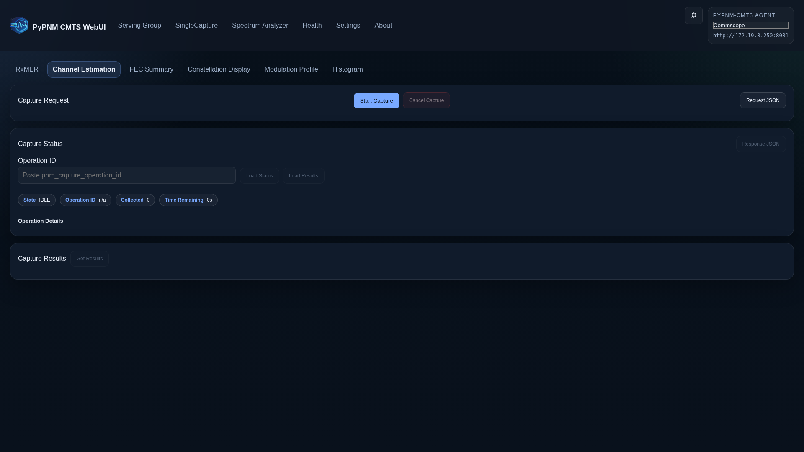](../../images/forms/serving-group-channel-est-coeff-form.png)

### Serving Group · FEC Summary

Route: `/serving-group/fec-summary`

[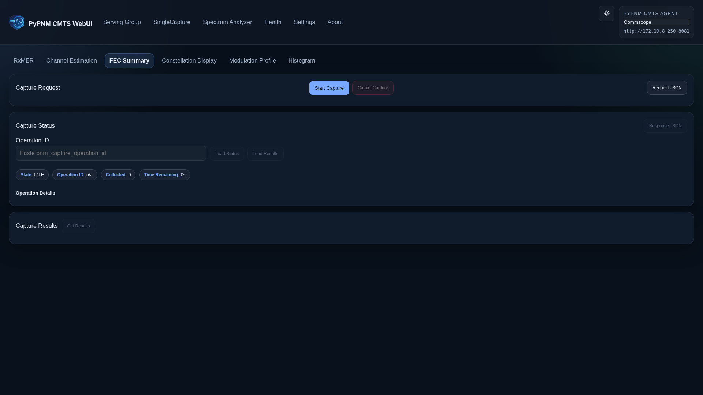](../../images/forms/serving-group-fec-summary-form.png)

### Serving Group · Constellation Display

Route: `/serving-group/constellation-display`

[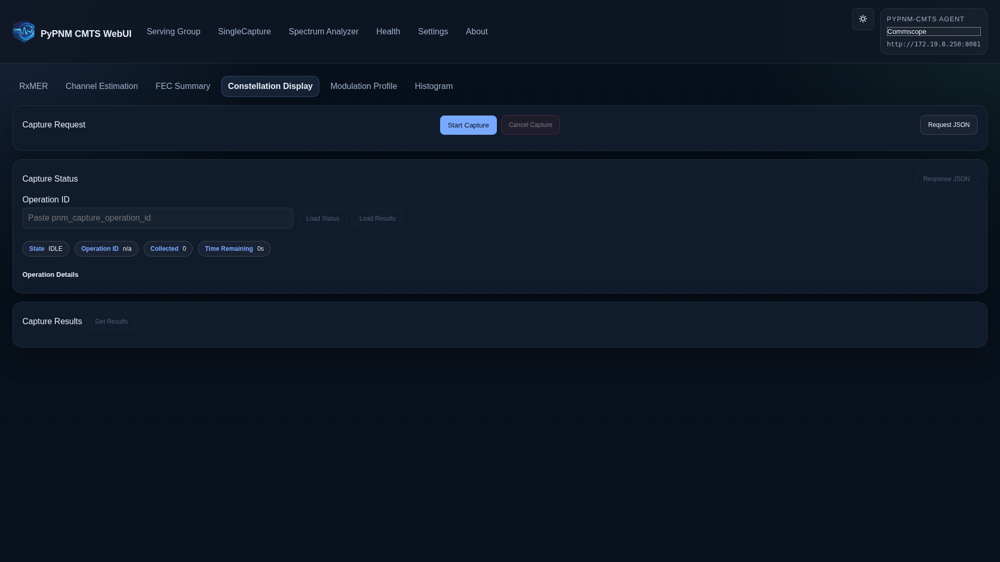](../../images/forms/serving-group-constellation-display-form.png)

### Serving Group · Modulation Profile

Route: `/serving-group/modulation-profile`

[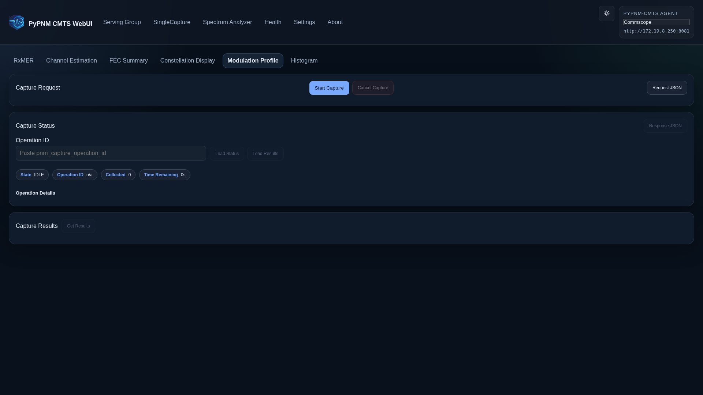](../../images/forms/serving-group-modulation-profile-form.png)

### Serving Group · Histogram

Route: `/serving-group/histogram`

[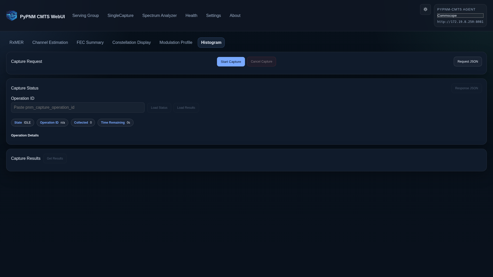](../../images/forms/serving-group-histogram-form.png)

## Spectrum Analyzer

### Spectrum Analyzer · Friendly

Route: `/spectrum-analyzer/friendly`

[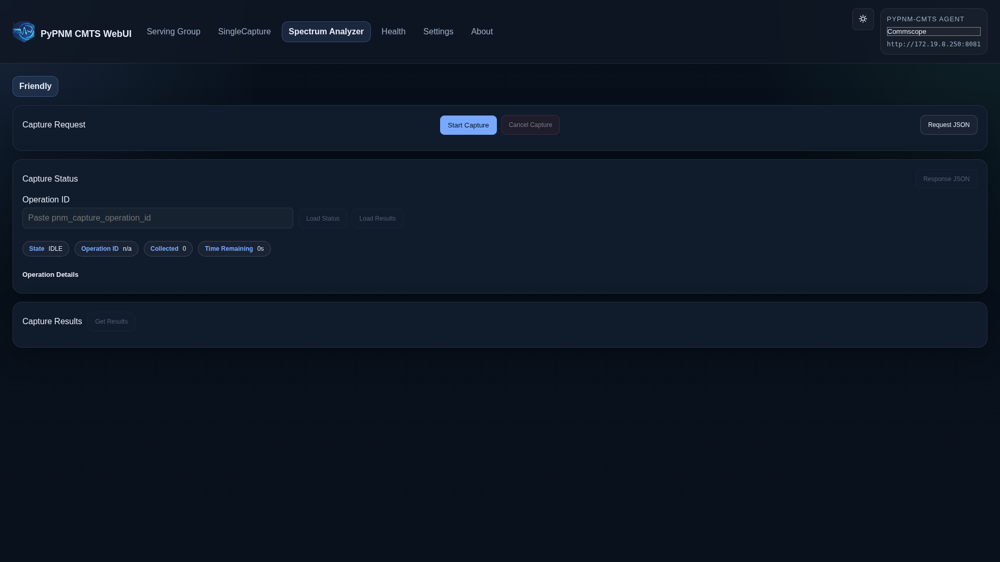](../../images/forms/spectrum-friendly-form.png)

### Spectrum Analyzer · Full Band

Route: `/spectrum-analyzer/full-band`

### Spectrum Analyzer · OFDM

Route: `/spectrum-analyzer/ofdm`

### Spectrum Analyzer · SCQAM

Route: `/spectrum-analyzer/scqam`

## Single Capture

### Single Capture · RxMER

Route: `/single-capture/rxmer`

[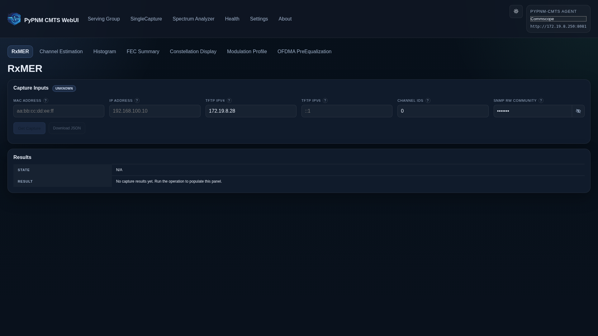](../../images/forms/single-capture-rxmer-form.png)

### Single Capture · Channel Est Coeff

Route: `/single-capture/channel-est-coeff`

[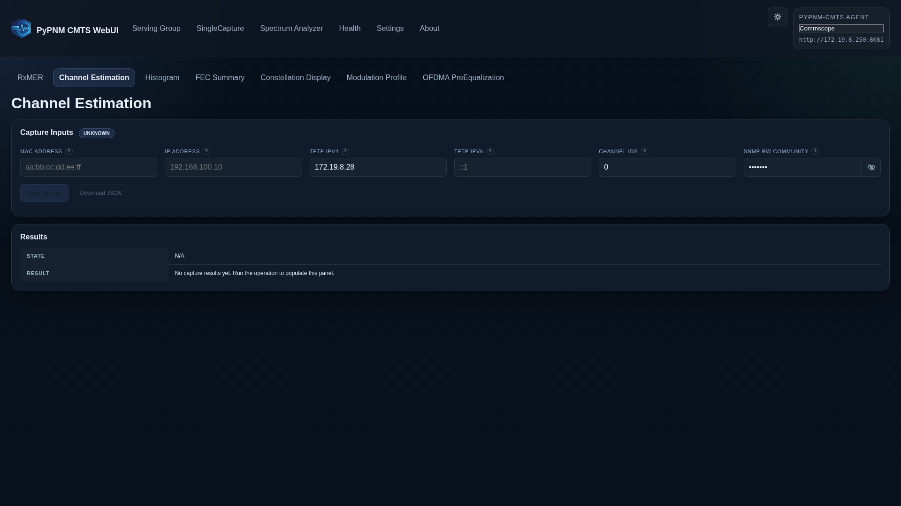](../../images/forms/single-capture-channel-est-coeff-form.png)

### Single Capture · Histogram

Route: `/single-capture/histogram`

[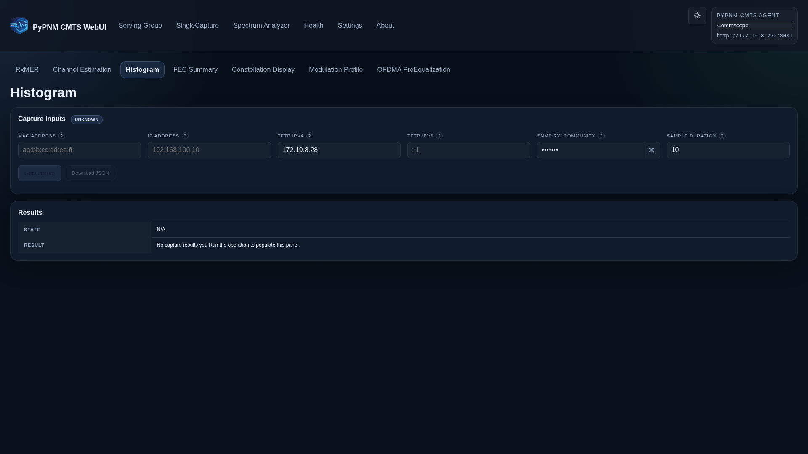](../../images/forms/single-capture-histogram-form.png)

### Single Capture · FEC Summary

Route: `/single-capture/fec-summary`

[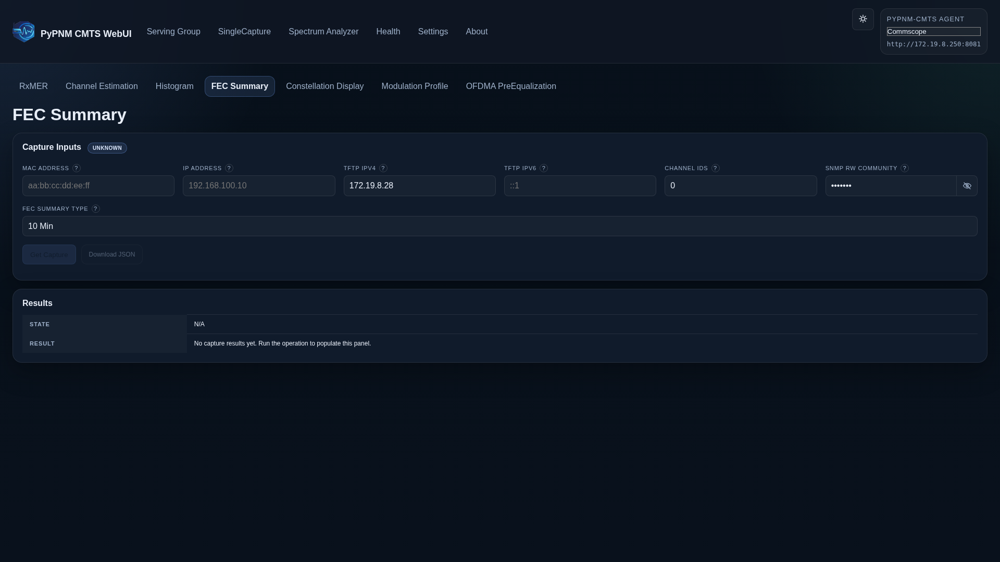](../../images/forms/single-capture-fec-summary-form.png)

### Single Capture · Constellation Display

Route: `/single-capture/constellation-display`

[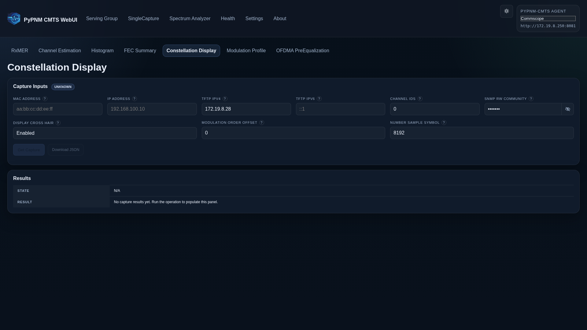](../../images/forms/single-capture-constellation-display-form.png)

### Single Capture · Modulation Profile

Route: `/single-capture/modulation-profile`

[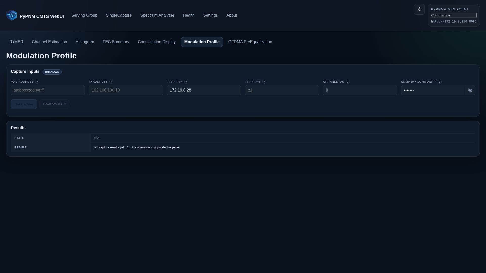](../../images/forms/single-capture-modulation-profile-form.png)

### Single Capture · OFDMA PreEqualization

Route: `/single-capture/us-ofdma-pre-equalization`

[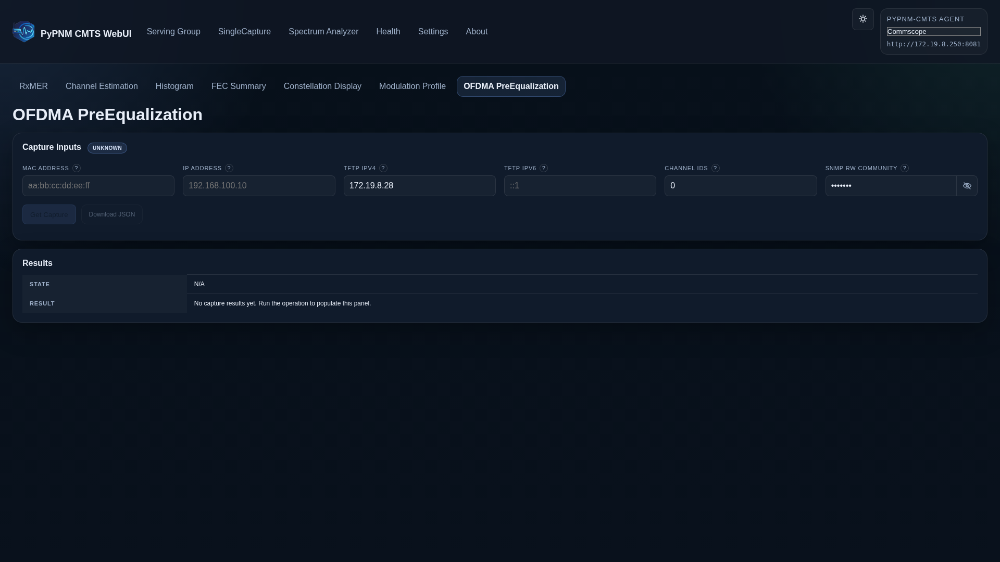](../../images/forms/single-capture-us-ofdma-pre-equalization-form.png)
